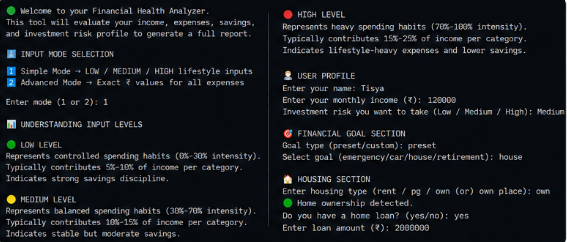
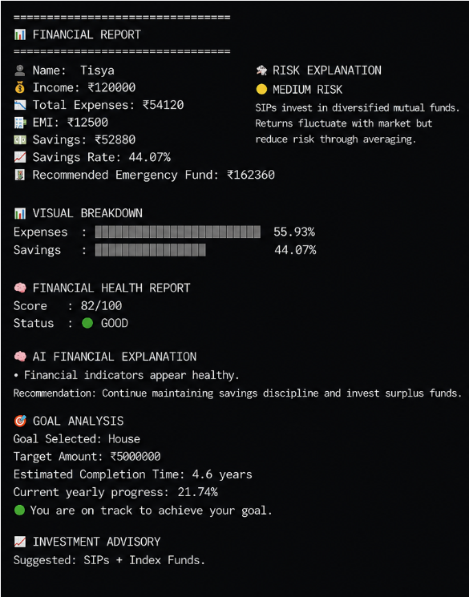

# 🚀 Featured Project

# 💰 Smart Finance Assistant

An AI-powered personal finance application built in **Python** that helps users analyze their financial health, optimize spending, forecast long-term wealth, and make smarter investment decisions.

  ---
# Workflow

Input

↓

Budget Analysis

↓

Goal Planning

↓

Investment Analysis

↓

Monte Carlo

↓

Optimization

↓

Trend Analysis

↓

Report

---


## 📊 Project Highlights

| Feature | Description |
|---------|-------------|
| 💻 Language | Python   |
| 📈 Financial Health Score | Calculates a personalized score (0–100) |
| 🎯 Goal Planning | Tracks progress towards financial goals |
| 📊 Monte Carlo Simulation | 1000-run 10-year wealth forecast |
| ⚡ Budget Optimization | Linear Programming using SciPy |
| 📉 Trend Analysis | Savings history visualization using Matplotlib |
| 📄 Report Generation | Automatic financial report export |
| 💾 Data Storage | CSV-based financial history |

---

# 📸 Project Demo

## 📸 Screenshots

### Home Screen



---

### Financial Report



---

### Savings Trend


Income:
₹120000

Expenses:
₹106602

Savings:
₹13398

Status:
GOOD

Financial Score:
82/100

---

### Monte Carlo Wealth Forecast

The application performs 1000 Monte Carlo simulations using randomly sampled inflation, salary growth and market return distributions to estimate future wealth instead of relying on a fixed CAGR.


---

### Budget Optimization

The optimizer uses scipy.optimize.linprog to maximize monthly savings while satisfying minimum expenditure constraints for groceries, food, travel, healthcare and miscellaneous expenses.


Budget Allocation

🥦 32%

🍔 28%

🚗 18%

🏥 12%

📦 10%

---

# ✨ Features

- 📊 Calculates Financial Health Score (0–100)
- 💰 Intelligent Budget Analysis
- 🎯 Financial Goal Planning
- 🏦 EMI Calculator
- 🛟 Emergency Fund Recommendation
- 📈 Personalized Investment Advisory
- 🎲 Monte Carlo Wealth Simulation (10-Year Forecast)
- ⚡ Budget Optimization using Linear Programming (SciPy)
- 📉 Savings Trend Analysis with Data Visualization
- 💾 Financial History Tracking (CSV Database)
- 📄 Automatic Financial Report Generation
- 💻 Interactive Command-Line Interface

---

# 🛠 Technologies Used

- Python 
- NumPy
- SciPy
- Matplotlib
- CSV
- Git
- GitHub

---

# 🧠 Concepts Demonstrated

- Financial Modeling
- Budget Analysis
- Monte Carlo Simulation
- Linear Programming
- Optimization Algorithms
- Data Visualization
- File Handling
- Report Generation
- Financial Forecasting

---
# Project Statistics
- 1000+ Lines of Python
- 10+ Financial Modules
- 1000 Monte Carlo Simulations
- Linear Programming Optimizer
- CSV Database
- Financial Scoring Engine
---


# 📂 Repository Structure

```text
Smart-Finance-Assistant
│
├── main.py
├── README.md
├── requirements.txt
├── LICENSE
├── Savings Trend.png
├── financial_report.png
├── Budget Optimization.png
├── Monte Carlo Wealth Forecast.png
├── home.png
└── .gitignore
```

---

# 🚀 Installation

Clone the repository

```bash
git clone https://github.com/TL-1009/Smart-Finance-Assistant.git
```

Move into the project folder

```bash
cd Smart-Finance-Assistant
```

Install dependencies

```bash
pip install -r requirements.txt
```

Run the project

```bash
python main.py
```
---

# 📜 License

This project is licensed under the **MIT License**.

Educational Project

This project is intended for educational purposes and should not be treated as professional financial advice.

---

# 👩‍💻 Author

**Tisya Lall**

GitHub: https://github.com/TL-1009

---
